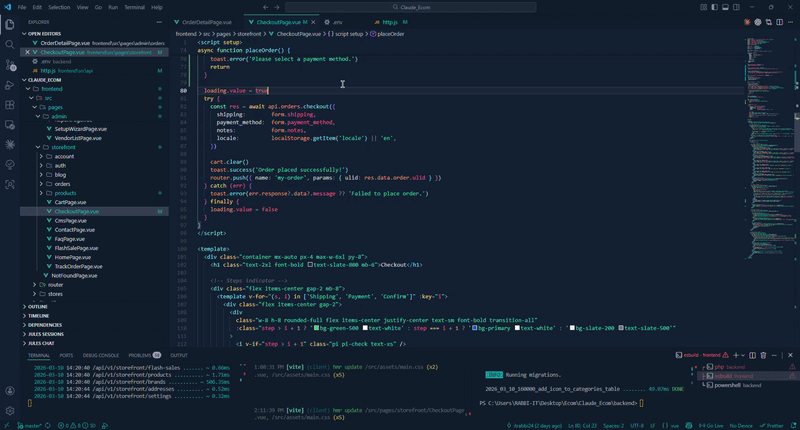

<div align="center">

# Git Message Generator By ARG RABBI

**Automatic conventional commit messages inside VS Code.**

[](./CHANGELOG.md)
[](https://marketplace.visualstudio.com/items?itemName=ARGRABBI.git-message-generator-by-arg-rabbi)
[](https://marketplace.visualstudio.com/items?itemName=ARGRABBI.git-message-generator-by-arg-rabbi)
[](https://marketplace.visualstudio.com/items?itemName=ARGRABBI.git-message-generator-by-arg-rabbi)
[](./LICENSE)
[](https://github.com/itrabbi24)

Developed by **ARG RABBI**  
GitHub: [itrabbi24](https://github.com/itrabbi24) · Portfolio: [itrabbi24.github.io](https://itrabbi24.github.io/)

[Install from Marketplace](https://marketplace.visualstudio.com/items?itemName=ARGRABBI.git-message-generator-by-arg-rabbi)

</div>

---

## Tutorial



---

## User Guide

### Why This Extension

You stage files, click one command, and get a conventional commit message instantly.

- No AI/API key required
- Works fully local
- Multi-signal analysis (path + diff + metadata)
- Confidence-aware message generation (high confidence = precise wording)
- Smart scope detection (`auth`, `deps`, etc.)

### Main Features

- Conventional commit types: `feat`, `fix`, `docs`, `style`, `refactor`, `perf`, `test`, `build`, `ci`, `chore`, `revert`
- Rename-aware wording
- Dependency-specific messages (`build(deps): ...`)
- Optional multi-line commit body with compacted context
- Large-diff safety fallback for stable performance
- Explain command: inspect why a message was generated

### Install

1. Open VS Code Extensions (`Ctrl+Shift+X`)
2. Search: **Git Message Generator By ARG RABBI**
3. Click Install

Or install directly from the [VS Code Marketplace](https://marketplace.visualstudio.com/items?itemName=ARGRABBI.git-message-generator-by-arg-rabbi).

### Quick Usage

1. Open a Git repository in VS Code
2. Stage your files (or keep unstaged if fallback enabled)
3. Open Source Control
4. Run `Generate Git Message`
5. Review and commit

Optional debug command:
- `Explain Last Generated Git Message`

### Example Outputs

```text
feat(auth): add createAccount
fix(api): guard token response
build(deps): update dependencies
refactor(core): remove legacyEngine.ts and add newEngine.ts
ci: update ci.yml, release.yml
```

### Configuration (Practical)

| Setting | Default | What it does |
|---|---|---|
| `commitGen.maxHeaderLength` | `72` | Max header length |
| `commitGen.maxAnalyzedLinesPerFile` | `1200` | Per-file diff line cap |
| `commitGen.maxContextsPerFile` | `12` | Context extraction cap |
| `commitGen.maxRawDiffChars` | `400000` | Huge diff fallback threshold |
| `commitGen.includeBody` | `true` | Include message body |
| `commitGen.bodyMaxLines` | `12` | Max body lines |
| `commitGen.bodyMaxContextsPerFile` | `2` | Max contexts per file in body |
| `commitGen.profile` | `balanced` | Scoring profile (`balanced/frontend/backend/infra`) |
| `commitGen.autoDetectProfile` | `true` | Auto detect profile when balanced |
| `commitGen.messageStyle` | `balanced` | Message verbosity (`concise/balanced/verbose`) |
| `commitGen.showConfidence` | `true` | Confidence notification |
| `commitGen.includeWorkingTreeWhenNoStaged` | `true` | Use unstaged if no staged changes |
| `commitGen.debugTelemetry` | `false` | Output timing/analysis metrics |

### Suggested Config (Balanced Real-World)

```json
{
  "commitGen.profile": "balanced",
  "commitGen.autoDetectProfile": true,
  "commitGen.messageStyle": "balanced",
  "commitGen.includeBody": true,
  "commitGen.bodyMaxLines": 10,
  "commitGen.maxHeaderLength": 72
}
```

### Troubleshooting

- No message generated:
  - Ensure repo is Git-initialized
  - Stage files or enable unstaged fallback
- Message too generic:
  - Split commit into smaller logical changes
  - Use `messageStyle: "verbose"`
- Large commit performance:
  - Adjust `maxAnalyzedLinesPerFile`
  - Keep `maxRawDiffChars` fallback enabled

---

## Developer Notes

### Architecture Summary

Pipeline:
1. `gitService.ts` collects changes
2. `analysisPipeline.ts` builds analyzed file set
3. scoring (`commitScorer.ts` + profile multipliers)
4. message composition (`messageComposer.ts`)
5. `extension.ts` orchestration + UX + explain command

Maintainer reference:
- [`docs/UPGRADE_PLAYBOOK.md`](./docs/UPGRADE_PLAYBOOK.md)

### Commands

```bash
npm install
npm run lint
npm run typecheck
npm run test
npm run build
npm run benchmark
npm run package:check
```

### Current Validation Quality

- Unit + golden regression tests are included
- Integration-style pure generation test is included
- Current benchmark script output (example from local run):

```text
small  files=5  lines=200   parseMs=37.28
medium files=20 lines=1600  parseMs=50.34
large  files=40 lines=6400  parseMs=201.88
```

### Release Automation

- CI validation workflow: lint + typecheck + test + build + package check
- Tag release workflow (`v*.*.*`) publishes VSIX artifact
- Release planning workflow + script:
  - `npm run release:plan`
  - `.github/workflows/release-plan.yml`

---

## Contributing

- [Issues](https://github.com/itrabbi24/Git_Message_Generator/issues)
- [Pull Requests](https://github.com/itrabbi24/Git_Message_Generator/pulls)

Please follow:
- [CONTRIBUTING.md](./CONTRIBUTING.md)
- [CODE_OF_CONDUCT.md](./CODE_OF_CONDUCT.md)

---

## License

MIT — [LICENSE](./LICENSE)

---

<div align="center">

Built with care by **ARG RABBI**

</div>
